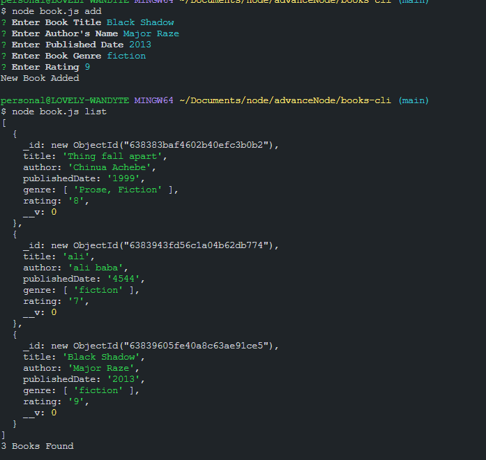

# Books Store Command Line API
> ### A command line interface project for storing book information which can be assessed throught the command line
---
*Language*
>*Javascript* (**NODE.JS**)
```javascript
npm install
```
___
_Dependencies_
* commander.js
* inquuirer.js
* mongoose
---

**_FEATURES_**
1. Add new book
1. Update book
1. find book by title or author name
1. Fetch all books
1. Delete book

> _image preview_

